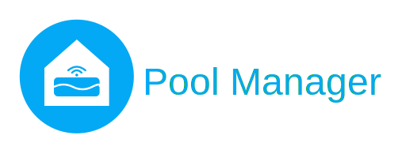

<!-- markdownlint-disable MD033 -->
<!-- markdownlint-disable MD041 -->

  

  <strong>A virtual pool management advisor for Home Assistant.</strong>

---

**Pool Manager** is a Home Assistant custom integration that aggregates
readings from your existing sensor entities (pH, ORP, temperature, and more)
and turns them into actionable pool management insights -- all locally,
with no cloud service or specific hardware required.

## Key Features

- **Computed analytics** -- Recommended daily filtration duration
  and a 0--100% water quality score, computed from your sensor data
- **Rule engine** -- Actionable recommendations with chemical product
  names and dosage in grams, covering pH, sanitizer/ORP, alkalinity,
  and algae risk
- **Chemistry tracking** -- Record chemical treatments, track active
  products and safety wait times, with automatic swimming safety
  determination
- **Treatment types** -- Support for chlorine, salt electrolysis,
  bromine, and active oxygen, with treatment-specific product
  recommendations
- **Filtration configuration** -- Support for different filtration
  types (sand, cartridge, diatomaceous earth, glass) with dedicated
  pump and temperature sensor settings
- **Automatic pump control** -- Daily pump scheduling with configurable
  start time and duration when a pump switch entity is configured
- **3 operational modes** -- Running, Active Wintering, and Passive
  Wintering, each with adapted filtration logic and rule behavior
- **Hardware agnostic** -- Works with any sensor source: dedicated pool
  probes (Flipr, iopool, Sutro), ESPHome DIY sensors, or manual input helpers
- **Reconfigurable** -- Chemistry and filtration settings can be updated at any time
  through the integration options, without removing the integration
- **Multi-language** -- English and French translations included

## How It Works

Pool Manager reads your existing Home Assistant sensor entities every 5 minutes and runs a local rule engine to produce:

1. A **water quality score** (0--100%) based on how close each parameter is to its ideal target
2. A **recommended filtration duration** using the classic temperature/2 rule, adjusted for your pump capacity
3. **Chemical dosage recommendations** with specific product and quantity (e.g., "Add 450g of pH-")
4. **Recommendations** for conditions like algae risk (high temperature + low ORP)

All computations happen locally. No cloud API, no account, no internet connection required.

## Quick Links

- [Getting Started](getting-started.md) -- Prerequisites, installation, and configuration
- [Entities](entities.md) -- Sensors, binary sensors, event entities, select, and filtration control entities
- [Chemistry Tracking](chemistry-tracking.md) -- Treatment recording, safety profiles, and swimming safety
- [Filtration Control](filtration-control.md) -- Automatic pump scheduling, events, and automation examples
- [Pool Modes](pool-modes.md) -- Running, Active Wintering, and Passive Wintering explained
- [Water Chemistry](water-chemistry.md) -- Target ranges, scoring, and parameter details
- [Rules & Recommendations](rules-and-recommendations.md) -- The rule engine, priority system, and chemical dosages
- [Sample Dashboards](sample-dashboards.md) -- Ready-to-use Lovelace dashboard examples
- [FAQ](faq.md) -- Common questions and answers about Pool Manager
- [Contributing](contributing.md) -- How to contribute to the project
